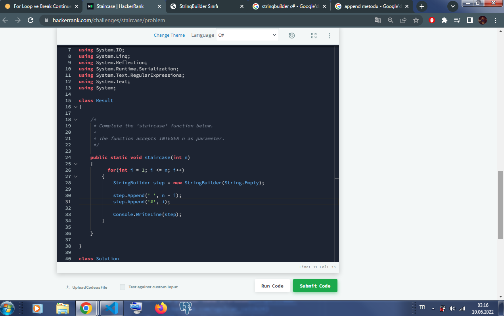

# forLoopveBreakContinueIfadeleri
[Kodluyoruz](https://app.patika.dev/) .Net eğitimi için hazırlanan C# For Loop ve Break Continue İfadeleri ödevidir. HackerRank Challenge Day 5: Loops & HackerRank Staircase sorularının cevabı için oluşturulmuştur.
## For Loop ve Break Continue Ifadeleri Ödevleri

## Ödev 1 - HackerRank Day 5: Loops
- Aşağıdaki for döngüsü yazılmış ve string interpolation ($"{}") kullanılarak döngü boyunca istenen verinin tekrar yazılması sağlanmıştır.
```
     for(int i=1; i<=10; i++)
        {
            Console.WriteLine($"{n} x {i} = {n*i}");
        }
```
- Görsel;
    

## Ödev 2 HackerRank Staircase

- İlk olarak 1den başlayıp n'e kadar birer artacak şekilde for döngüsü tanımlanmıştır.
- String ifadelerin birleşmesi için StringBuilder sınıfında step nesnesi boş olarak oluşturuldu.
- Append liste metodu kullanılmış, bu metodla step nesnesine boşlulkar ve # eklenmiştir. Son olarak step nesnesi konsola yazdırılmıştır.

```
     for(int i = 1; i <= n; i++)
    {
        StringBuilder step = new StringBuilder(String.Empty);
            
        step.Append(' ', n - i);
        step.Append('#', i);
            
        Console.WriteLine(step);
    }

```

- Görsel;
    
    
### [Hacker Rank Profilim](https://www.hackerrank.com/ogulcan_celik24) 
#### https://www.hackerrank.com/ogulcan_celik24
#### www.patika.dev